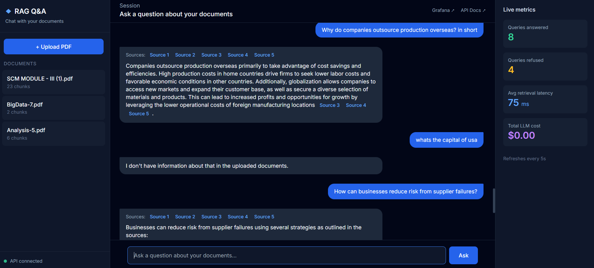

# RAG Document Q&A Application



A production-style Retrieval-Augmented Generation (RAG) application that answers questions over user-uploaded PDF documents with citation-backed responses. Built end-to-end with FastAPI, PostgreSQL + pgvector, OpenAI, Docker, and observability via Prometheus + Grafana.

The project was built to demonstrate the full lifecycle of an AI-powered application: not only the retrieval and generation logic, but also the surrounding infrastructure that makes such a system deployable and observable in production — containerization, metrics, dashboards, CI/CD, and a real user interface.

---

## The problem this solves

Large language models such as GPT are trained on a fixed snapshot of public data. They have no knowledge of private documents like an internal report, a research paper you just uploaded, or a company handbook. Even for public information, their context window is finite, so it is impractical to paste an entire multi-page document into the prompt every time a user asks a question.

Retrieval-Augmented Generation solves both problems. Instead of relying on the model's memory, the application first stores the document in a way that allows efficient search by *meaning*. When a question is asked, the application retrieves only the small handful of passages most relevant to that question, and then hands those passages to the language model along with the question. The model produces an answer grounded in the retrieved text and cites which passages it used.

---

## How the application works

The application is built around two independent pipelines: one for ingesting documents and one for answering questions.

### Ingestion pipeline

When a user uploads a PDF, the following happens:

1. **Text extraction.** The PDF file is parsed with the `pypdf` library, and the raw text of every page is concatenated into a single string.

2. **Chunking.** That text is split into overlapping pieces of roughly 500 tokens each, with a 50-token overlap between consecutive chunks. Splitting is done using OpenAI's `tiktoken` tokenizer, so the chunk sizes match how the model itself counts text. The overlap ensures that if an important sentence sits exactly on a chunk boundary, it isn't destroyed — it survives whole in at least one of the two neighboring chunks.

3. **Embedding.** Each chunk is passed to OpenAI's `text-embedding-3-small` model, which converts the text into a 1536-dimensional vector of numbers. This vector is best thought of as coordinates on a very large "map of meaning" — chunks with similar meaning end up as vectors that are close together. All chunks are embedded in a single batched API call rather than one-at-a-time, which reduces both cost and latency significantly.

4. **Storage.** The application creates a row in a `documents` table for the file, then inserts one row per chunk into a `chunks` table. The chunks table has a normal text column for the content plus a special `vector(1536)` column for the embedding, made possible by the `pgvector` PostgreSQL extension.

### Query pipeline

When a user asks a question, the following happens:

1. **Question embedding.** The question is embedded using the *same* model as the chunks. This is essential: similarity comparisons are only meaningful when both vectors live in the same vector space.

2. **Vector search.** The application asks PostgreSQL, via pgvector's `<=>` operator, to return the top-k chunks (default: 5) whose vectors are closest to the question's vector, measured by cosine distance. This is semantic search — it can match "salary" to "compensation" even though no words are shared.

3. **Relevance threshold.** Vector search *always* returns the top-k closest chunks, even when none of them are truly relevant. If the best chunk's distance is above a configured threshold (0.6 in this project), the application refuses to answer and returns *"I don't have information about that in the uploaded documents."* This is the anti-hallucination guardrail. Without it, the app would happily send irrelevant chunks to the language model and the model might improvise a plausible but fabricated answer.

4. **Prompt construction.** The retrieved chunks are labeled `[Source 1]`, `[Source 2]`, and so on, and inserted into a prompt along with strict instructions: *"answer using only the provided sources and cite each fact with [Source N]."*

5. **Generation.** The prompt is sent to OpenAI's `gpt-4o-mini` model. The response is streamed to the client token-by-token using Server-Sent Events (SSE), so the user sees the answer typing itself out rather than waiting for the whole response. Citations mapping each source number back to its chunk ID and document ID are delivered up front.

---

## Technology choices and why

**FastAPI** is the web framework. It is modern, natively asynchronous (important for streaming), and it auto-generates an interactive documentation page at `/docs` that is extremely useful for testing.

**PostgreSQL with the pgvector extension** is the database. Using one database for both relational data (documents, chunks, metadata) and vector search means fewer moving parts to run and monitor than adopting a dedicated vector database like Pinecone or Weaviate. For a project at this scale, the simpler operational story wins.

**OpenAI's `text-embedding-3-small`** was chosen for embeddings and **`gpt-4o-mini`** for generation. Both are fast, cheap, and high quality. The embedding model was selected specifically because its 1536-dimension output is the widely-used default that most tooling assumes.

**Docker and Docker Compose** are used to run every piece — the API, the database, the metrics stack — as containers. The entire stack starts with a single `docker compose up` command, which is what interviewers expect to see in a production-adjacent project.

**Prometheus** collects metrics and **Grafana** visualizes them. This is the standard open-source observability stack used at essentially every company. The API exposes metrics on a `/metrics` endpoint, Prometheus scrapes that endpoint every five seconds, and Grafana draws real-time charts from Prometheus.

**GitHub Actions** runs a two-job CI pipeline on every push: a Python smoke test that verifies imports and installs dependencies, then a Docker build that catches container issues before deploy.

---

## Observability

The `/ask` endpoint is instrumented to record four metrics that answer the questions any production AI team cares about daily:

- **`rag_retrieval_latency_seconds`** is a histogram that tracks how long the pgvector search takes. This tells you whether retrieval is your bottleneck.

- **`rag_tokens_used_total`** is a counter, split into `prompt` and `completion` labels, tracking cumulative token consumption. Tokens map directly to spend.

- **`rag_cost_dollars_total`** is a counter that accumulates the estimated dollar cost per request, computed from the token counts and the model's public pricing.

- **`rag_queries_total`** is a counter split into `answered` and `refused` outcomes, so you can see how often the relevance threshold is triggering.

These metrics are visible on the "RAG Metrics" Grafana dashboard, which contains one panel per metric. A live summary is also shown in the right-hand panel of the web dashboard.

---

## Frontend

The project ships with a dark-themed single-page dashboard (`index.html`) that consumes the API directly. It provides:

- A sidebar listing all uploaded documents with their chunk counts, plus an upload button
- A chat-style main area where questions stream in token-by-token with inline citation badges
- A live metrics panel on the right that polls `/metrics` every five seconds and shows queries answered, queries refused, average retrieval latency, and total LLM cost
- Direct links to the Grafana dashboard and the FastAPI Swagger docs

The frontend is a single HTML file — no build step, just plain HTML, Tailwind CSS (via CDN), and vanilla JavaScript.

---

## Endpoints

- `GET /` — health check that returns `{"message": "RAG app is alive"}`.
- `GET /documents` — returns all uploaded documents with metadata.
- `POST /upload` — accepts a PDF file upload and runs the full ingestion pipeline.
- `POST /ask` — accepts a JSON body with a `query` and optional `top_k`, and returns the complete answer with citations.
- `POST /ask/stream` — same input, but streams the response as Server-Sent Events.
- `DELETE /documents/{id}` — removes a document and all of its chunks.
- `GET /metrics` — Prometheus scrape endpoint.
- `GET /docs` — auto-generated interactive Swagger UI.

An example request body for `/ask` looks like:

```json
{
  "query": "How can businesses reduce risk from supplier failures?",
  "top_k": 5
}
```

---

## Prerequisites

You need three things installed on your machine before running this project:

1. **Docker Desktop** — this project runs everything inside containers, so Docker is the only runtime requirement. Download from docker.com and make sure the Docker engine is running before proceeding.

2. **Git** — for cloning the repository. Any recent version works.

3. **An OpenAI API key** — sign up at platform.openai.com, add a small amount of credit ($5 is more than enough for extensive testing), and generate an API key at platform.openai.com/api-keys.

You do *not* need to install Python, Postgres, or any of the Python libraries on your host machine. Everything runs inside containers.

---

## How to run

Clone the repository:

```bash
git clone https://github.com/Pranitha9102/rag-document-qa-app.git
cd rag-document-qa-app
```

Create a `.env` file in the project root containing your OpenAI API key:

```
OPENAI_API_KEY=sk-your-actual-key-here
```

This file is listed in `.gitignore` and will never be committed. In production the same variable would come from a secrets manager rather than a file.

Start the entire stack with a single command:

```bash
docker compose up -d --build
```

The first run will take a couple of minutes because Docker needs to build the app image and download the Postgres, Prometheus, and Grafana images. Subsequent runs start in seconds.

Once it's running, four services are available:

- **Web dashboard** — open `index.html` in a browser (double-click, or use a local server like VS Code Live Server)
- **API** — http://localhost:8000
- **Interactive API docs** — http://localhost:8000/docs
- **Grafana dashboards** — http://localhost:3000 (login: `admin` / `admin`)
- **Prometheus** — http://localhost:9090

To try the app end-to-end: open the dashboard, upload any PDF, then ask a question about its contents. Ask an unrelated question and watch the relevance threshold kick in and refuse to answer.

To stop everything:

```bash
docker compose down
```

The database and Grafana dashboards persist between restarts because they are stored in named Docker volumes.

---

## Project structure

- **`main.py`** defines the FastAPI application and all endpoints.
- **`database.py`** sets up the SQLAlchemy engine and session for talking to Postgres.
- **`models.py`** defines the two database tables — `Document` and `Chunk` — including the pgvector-typed embedding column.
- **`chunking.py`** contains the token-aware chunking function.
- **`embeddings.py`** wraps calls to the OpenAI embedding API, both single and batch.
- **`metrics.py`** defines the four Prometheus metrics used throughout the app.
- **`index.html`** is the single-page dashboard frontend.
- **`Dockerfile`** is the recipe Docker uses to build the API container image.
- **`docker-compose.yml`** declares the four services (app, database, Prometheus, Grafana) and wires them together.
- **`prometheus.yml`** tells Prometheus which endpoint to scrape and how often.
- **`requirements.txt`** pins the exact Python library versions.
- **`.github/workflows/ci.yml`** defines the GitHub Actions CI pipeline.
- **`.gitignore`** and **`.dockerignore`** exclude secrets, virtualenvs, and build artifacts.

---

## Roadmap

Planned improvements: an HNSW index on the vector column to speed up search at scale, OpenTelemetry traces to complement the existing metrics, multi-tenant isolation so different users cannot see each other's documents, and evaluation harnesses that measure answer quality against a labeled test set.